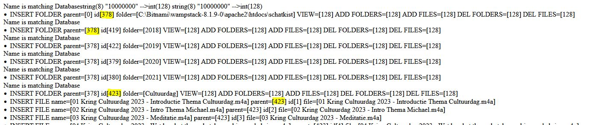
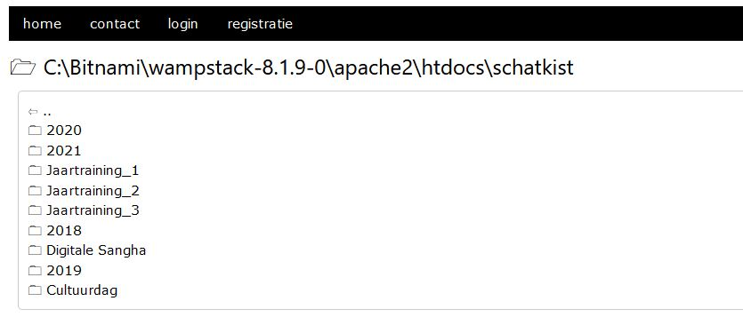

# Recursion
Recursion

Te scan program checkes if the file and/or folder
* Is already present in database? 
* If so, check name and update if changed (but keep ID)
* If not, add folder/file to database and create Unique ID and save it's parent folder

